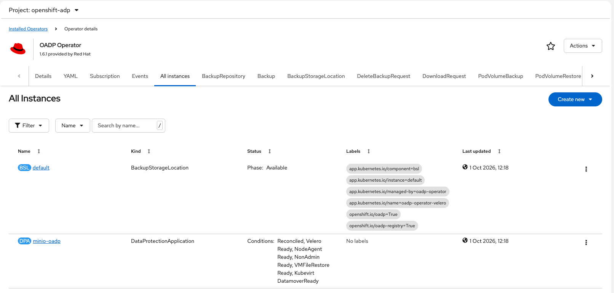
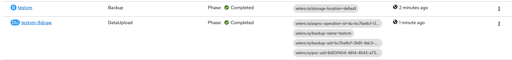
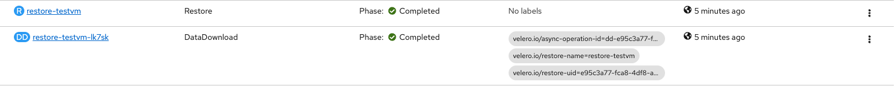

# OADP for OpenShift Virtualization

## Prerequisits

* OpenShift Virtualization
* OADP Operator installed
* S3 Bucket

## Backup steps

1. Create a secret with S3 AK/SK

2. Create DataProtectionApplication with kubevirt plugin and external S3
```
apiVersion: oadp.openshift.io/v1alpha1
kind: DataProtectionApplication
metadata:
  name: minio-oadp
  namespace: openshift-adp
spec:
  configuration:
    velero:
      defaultPlugins:
        - aws
        - kubevirt
        - csi
        - openshift
      resourceTimeout: 10m
    nodeAgent:
      enable: true
      uploaderType: kopia
    vmFileRestore:
      enable: true
  backupLocations:
    - name: default
      velero:
        provider: aws
        default: true
        objectStorage:
          bucket: oadp
          prefix: sno
        config:
          region: minio
          profile: "default"
          s3Url: "http://minio-api-minio.apps.ocp.drkspace.fr"
          s3ForcePathStyle: "true"
        credential:
          key: cloud
          name: cloud-credentials
  snapshotLocations: []
```



3. Create a VM with the lable backup=true
```
apiVersion: kubevirt.io/v1
kind: VirtualMachine
metadata:
  name: testvm
  generation: 1
  namespace: vms
  finalizers:
    - kubevirt.io/virtualMachineControllerFinalize
  labels:
    app: testvm
    backup: 'true'
    velero.io/restore-name: restore-testvm
    vm.kubevirt.io/template: rhel9-server-small
    kubevirt.io/dynamic-credentials-support: 'true'
    velero.io/backup-name: testvm
    vm.kubevirt.io/template.version: v0.35.0
    vm.kubevirt.io/template.namespace: openshift
    vm.kubevirt.io/template.revision: '1'
spec:
  dataVolumeTemplates:
    - apiVersion: cdi.kubevirt.io/v1beta1
      kind: DataVolume
      metadata:
        name: testvm
      spec:
        sourceRef:
          kind: DataSource
          name: rhel9
          namespace: openshift-virtualization-os-images
        storage:
          resources:
            requests:
              storage: 30Gi
  runStrategy: RerunOnFailure
  template:
    metadata:
      annotations:
        kubevirt.io/pci-topology-version: v3
        vm.kubevirt.io/flavor: small
        vm.kubevirt.io/os: rhel9
        vm.kubevirt.io/workload: server
      labels:
        kubevirt.io/domain: testvm
        kubevirt.io/size: small
    spec:
      accessCredentials:
        - sshPublicKey:
            propagationMethod:
              qemuGuestAgent:
                users:
                  - cloud-user
            source:
              secret:
                secretName: dm-key
      architecture: amd64
      domain:
        cpu:
          cores: 1
          sockets: 1
          threads: 1
        devices:
          disks:
            - disk:
                bus: virtio
              name: rootdisk
            - disk:
                bus: virtio
              name: cloudinitdisk
          interfaces:
            - macAddress: '02:78:0c:f4:fc:17'
              masquerade: {}
              model: virtio
              name: default
          rng: {}
        features:
          acpi: {}
          smm:
            enabled: true
        firmware:
          bootloader:
            efi: {}
          serial: 00cdebc9-6034-430c-a2af-64fc85bc823b
          uuid: 94d288ab-a8e6-4534-a84c-4cd12622fc6d
        machine:
          type: pc-q35-rhel9.8.0
        memory:
          guest: 2Gi
        resources: {}
      networks:
        - name: default
          pod: {}
      terminationGracePeriodSeconds: 180
      volumes:
        - dataVolume:
            name: testvm
          name: rootdisk
        - cloudInitNoCloud:
            userData: |
              #cloud-config
              user: cloud-user
              password: vlar-q3ri-e668
              chpasswd:
                expire: false
              runcmd:
                - setsebool -P virt_qemu_ga_manage_ssh on
          name: cloudinitdisk
```

4. Create a backup based on label
```
apiVersion: velero.io/v1
kind: Backup
metadata:
  name: testvm
  namespace: openshift-adp
spec:
  includedNamespaces:
    - vms
  orLabelSelectors:
    - matchLabels:
        backup: "true"
  snapshotMoveData: true
  storageLocation: default
  ttl: 720h0m0s
```



5. Delete the VM

6. Restore the backup
```
apiVersion: velero.io/v1
kind: Restore
metadata:
  name: restore-testvm
  namespace: openshift-adp
spec:
  # Nom de la sauvegarde à utiliser
  backupName: testvm
  # Restreindre uniquement au namespace vms
  includedNamespaces:
    - vms
```

