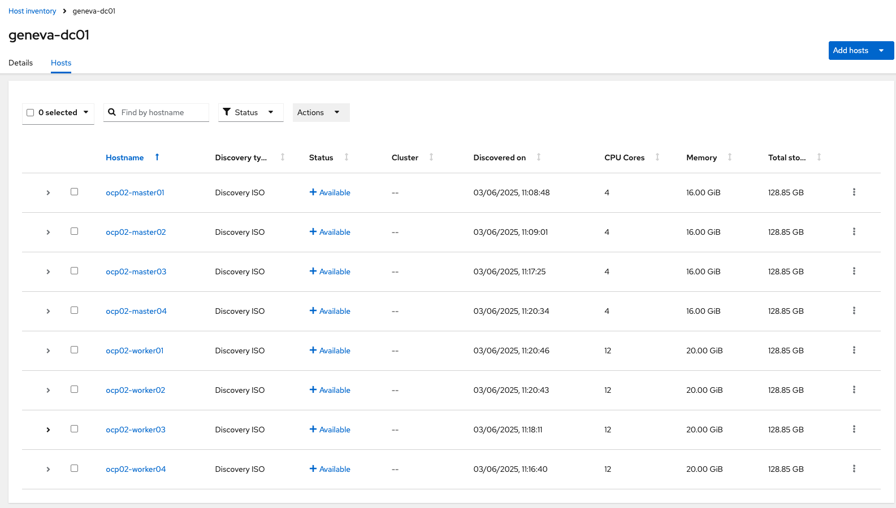

# OpenShift Bare Metal with a 2+2 or 2+3 master node

## Why?

## Difference between 2+2 and 2+3 control plane

## 2+2 Control plane

### Schema

### Deployment

1. Host inventory via ACM

2. Select a 2+2 or 2+3 control plane

3. Cluster deployement

