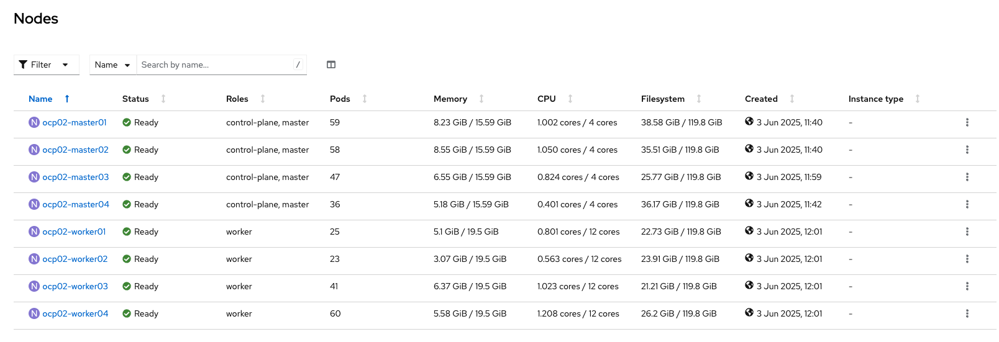

# OpenShift Bare Metal with a 2+2 or 2+3 master node

## Why?


## Difference between 2+2 and 2+3 control plane


## 2+2 Control plane

### Schema

AZ1
master01
master02
worker01
worker02

AZ2
master03
master04
worker03
worker04

### Deployment

**1. Host inventory via ACM**


**2. Select a 2+2 or 2+3 control plane**


**3. Cluster deployement**




### Stop AZ1 and peform PRA

**1. Stop all servers in AZ1**

**2. Connect on a survive master node**
```
ssh -i .ssh/pub_key core@master4-ip
```

**3. Use quorum restore script**
```
[core@master04 ~]$ sudo -E /usr/local/bin/quorum-restore.sh
...stopping etcd-pod.yaml
Waiting for container etcd to stop
...........................complete
Waiting for container etcdctl to stop
...complete
Waiting for container etcd-metrics to stop
complete
Waiting for container etcd-readyz to stop
complete
Waiting for container etcd-rev to stop
complete
Waiting for container etcd-backup-server to stop
complete
starting restore-etcd static pod
```

**4. Wait 10 min to have access to your cluster**

**5. Pods and VMs are automatically recovered**
* Pods with K8S scheduling
* VMs via Self Remediation and Node Health Check