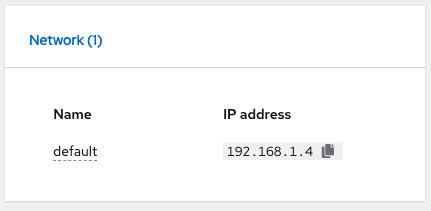
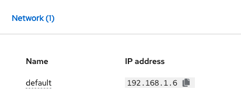
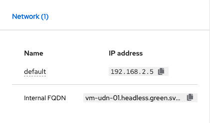
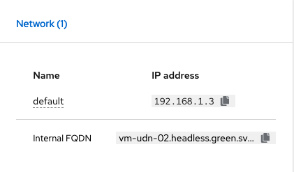

# How use User Defined Network 


## Deployment UDN

1. Create a namespace with correct label
```
apiVersion: v1
kind: Namespace
metadata:
  name: blue
  labels:
    k8s.ovn.org/primary-user-defined-network: ""
```

```
apiVersion: v1
kind: Namespace
metadata:
  name: green
  labels:
    k8s.ovn.org/primary-user-defined-network: ""
```

2. Create a L2 or L3
```
apiVersion: k8s.ovn.org/v1
kind: UserDefinedNetwork
metadata:
  name: udn-l2-blue
  namespace: blue
spec:
  topology: Layer2
  layer2:
    role: Primary
    subnets:
      - "192.168.1.0/24"
    ipam:
      lifecycle: Persistent
```

```
apiVersion: k8s.ovn.org/v1
kind: UserDefinedNetwork
metadata:
  name: udn-l3-green
  namespace: green
spec:
  topology: Layer3
  layer3:
    role: Primary
    subnets:
      - cidr: "192.168.0.0/16"
        hostSubnet: 24
```

3. Deploy VMs


## Result L2

**VM1:**




**VM2:**



## Result L3

**VM1:**



**VM2:**



**VM3:**


## Deployment CUDN

1. Create a CUDN
```
apiVersion: k8s.ovn.org/v1
kind: ClusterUserDefinedNetwork
metadata:
  name: udn01
spec:
  namespaceSelector: 
    matchExpressions:
    - key: kubernetes.io/metadata.name
      operator: In
      values: ["blue", "green"]
  network: 
    topology: Layer2 
    layer2: 
      role: Primary 
      subnets:
        - "192.168.10.0/24" 
      ipam:
        lifecycle: Persistent
```

## Deployment Localnet UDN

1. Create a NodeNetworkConfigurationPolicy
```
apiVersion: nmstate.io/v1
kind: NodeNetworkConfigurationPolicy
metadata:
  name: ovs-share-vlan82
spec:
  nodeSelector:
    node-role.kubernetes.io/worker: ""
  desiredState:
    ovn:
      bridge-mappings:
        - localnet: vlan82
          bridge: br-ex
```

2. Create a NetworkAttachementDefinition for blue namespace
```
apiVersion: k8s.cni.cncf.io/v1
kind: NetworkAttachmentDefinition
metadata:
  name: underlay-vlan82
  namespace: blue
spec:
  config: |2
    {
      "cniVersion": "0.4.0",
      "name": "underlay-vlan82",
      "type": "ovn-k8s-cni-overlay",
      "topology": "localnet",
      "physicalNetworkName": "vlan82",
      "netAttachDefName": "blue/underlay-vlan82"

    }
```

2. Create a NetworkAttachementDefinition for green namespace
```
apiVersion: k8s.cni.cncf.io/v1
kind: NetworkAttachmentDefinition
metadata:
  name: underlay-vlan82
  namespace: green
spec:
  config: |2
    {
      "cniVersion": "0.4.0",
      "name": "underlay-vlan82",
      "type": "ovn-k8s-cni-overlay",
      "topology": "localnet",
      "physicalNetworkName": "vlan82",
      "netAttachDefName": "green/underlay-vlan82"

    }
```