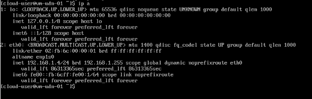

# How use User Defined Network 


## Deployment

1. Create a namespace with correct label
```
apiVersion: v1
kind: Namespace
metadata:
  name: blue
  labels:
    k8s.ovn.org/primary-user-defined-network: ""
```

```
apiVersion: v1
kind: Namespace
metadata:
  name: green
  labels:
    k8s.ovn.org/primary-user-defined-network: ""
```

2. Create a L2 or L3
```
apiVersion: k8s.ovn.org/v1
kind: UserDefinedNetwork
metadata:
  name: udn-l2-blue
  namespace: blue
spec:
  topology: Layer2
  layer2:
    role: Primary
    subnets:
      - "192.168.1.0/24"
```

```
apiVersion: k8s.ovn.org/v1
kind: UserDefinedNetwork
metadata:
  name: udn-l3-green
  namespace: green
spec:
  topology: Layer3
  layer3:
    role: Primary
    subnets:
      - cidr: "192.168.0.0/16"
        hostSubnet: 24
```

3. Deploy VMs


## Result L2

VM1



VM2
